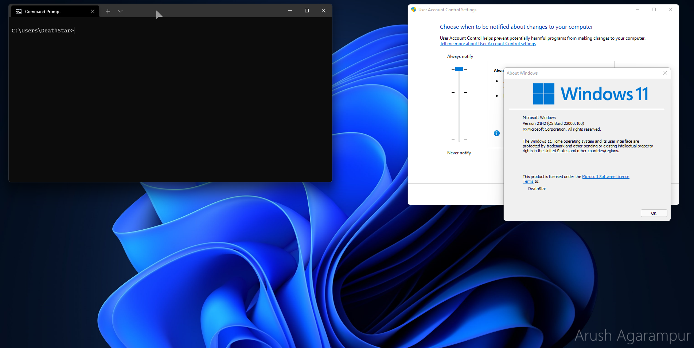
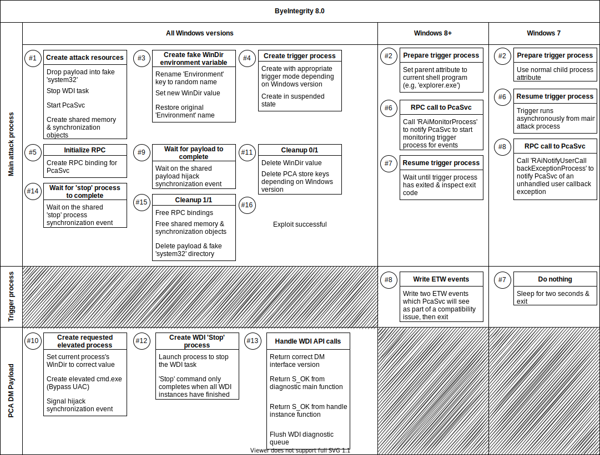

  <h1 align="center">
    ByeIntegrity 8.0
  </h1>

The eighth Windows privilege escalation attack in the ByeIntegrity family. ByeIntegrity 8.0 is the most complex one I've created so far; however, because of its complexity, it's able to reveal and exploit hidden design and security flaws in the operating system. After all, it even works when UAC is set to its maximum security level — **AlwaysNotify**.

## Attack overview
Just like every other ByeIntegrity attack, ByeIntegrity 8.0 needs to be run under an account with administrator privileges. ByeIntegrity 8.0 relies on the Task Scheduler to start the *WDI ResolutionHost* task. The task is started with an elevated token of the current user that the task scheduler creates. The task proceeds to read parameters from the WDI host and reads from the registry to figure out where to load the requested diagnostic module. These module paths are stored in the registry with the form `%WinDir%\System32\...`. ByeIntegrity 8.0 sets a custom `WinDir` environment variable to load its own payload module into the *ResolutionHost* task, which then launches any program inheriting the full administrative privileges.

## How it works
The majority of the ByeIntegrity 8.0 attack is getting the *WDI ResolutionHost* started. This task is triggered to start via an ETW event. There are many services which write events to trigger the task (Windows Resource Exhaustion, Corrupted File Recovery, etc.).

The Program Compatibility Assistant (PCA) is part of Windows's *Application Experience*, and will automatically monitor processes for problematic behaviors and attempt to resolve them. It is implemented as a service, *PcaSvc*, and in a set of libraries, `apphelp.dll`, being one of them. `apphelp.dll` will hook certain WinAPI functions depending on what *genome* (Application type: Win7RTM, WinBlueRTM, etc.) *PcaSvc* decides the process contains. `apphelp.dll` intercepts the function calls and reports back any possible results to *PcaSvc* via writing ETW events. *PcaSvc* inspects the event information, and if it matches a threshold, *PcaSvc* will attempt to start the *Program Compatibility Assistant Troubleshooter*. This is implemented as a diagnostic module (DM), and it is loaded via the *WDI ResolutionHost* task. *PcaSvc* starts this task with its parameters by triggering it via the PCA's "start diagnostics" ETW event write. (If you're thinking of simply writing this ETW event manually to launch the DM, you'll be greeted with an *Access is denied* error.)
#
ByeIntegrity 8.0 creates this sequence of events in a controlled, exploitable manner. On Windows 8+, only processes launched from Windows Explorer are monitored *PcaSvc*, as explorer calls `pcacli!PcaMonitorProcess` to tell *PcaSvc* to start monitoring the process for events. ByeIntegrity 8.0 uses RPC to talk directly to *PcaSvc* to tell it to monitor the "trigger" process ByeIntegrity 8.0 launches. Talking directly via RPC to *PcaSvc* is better, faster, more controlled, and it also allows ByeIntegrity 8.0 to also bypass a policy that can disable the PCA if it is set. The "trigger" process writes two ETW events that `apphelp.dll` would usually write if it detects a program is displaying an error message box about running on an incorrect version of Windows.

On Windows 7, a different method is used. If the PCA detects an unhandled exception that occurs during a user callback, it will attempt to launch the DM. *PcaSvc* monitors all processes launched, nothing is required from explorer here. If such an exception is caught, *PcaSvc* will launch the DM. The function that Windows 7's *PcaSvc* uses to handle detection of an unhandled callback exception is actually an RPC function that *PcaSvc* calls from itself. ByeIntegrity 8.0 once again uses RPC to call this function remotely, triggering the launch of the DM manually.
#
Once the DM is launched, it loads the ByeIntegrity 8.0 *Pca Payload*. This payload acts as a WDI diagnostic module. When loaded, it creates the requested process as a child of the *WDI ResolutionHost* task executable (`taskhostw.exe`). The payload needs to export a few WDI functions in order to function properly. These functions initialize the WDI diagnostics instance (PCA diagnostics in this case) and then flush the diagnostics queue so that ByeIntegrity 8.0 can be run multiple times and so that the PCA does not re-launch the DM multiple times because of the diagnostic instance still being in the queue. Finally, the task is stopped and after cleanup, the whole process can be repeated again.

## Attack schema + Windows Defender bypass

Evident from the above, this is a pretty complex attack that abuses many things:

- Program Compatibility Assistant
- Poor Windows Defender design
- Environment variables
- Task Scheduler
- DLL Hijack
- ETW
- RPC
- WDI

  
Complete attack diagram

  
  

Windows Defender was discovered to be a small annoyance while developing this attack. Windows Defender's filter driver catches the creation of a rouge `WinDir` value in the `HKCU\Environment` key. If caught, Windows Defender will eventually kill the offending process. The problem is there is a huge delay after the notification from the filter driver and the action taken by Windows Defender. Every time, Windows Defender completely misses the attack. In order to bypass even detection by Windows Defender, ByeIntegrity 8.0 renames the `HKCU\Environment` key a random name, creates `WinDir` in the fake key, then renames it back to `HKCU\Environment`. And Windows Defender doesn’t even notice a thing. Credit for this trick — **@hfiref0x** — who discovered it while working on UACMe method integration.

## UACMe
ByeIntegrity 8.0 is implemented in UACMe as method number 69. Implementations are the exact same except UACMe uses only `NdrClientCall2` for RPC calls, and does not use the custom `RpcBindingSetOption()` that ByeIntegrity 8.0 uses. These two differences don't change anything about the attack.

## Using the code
If you’re reading this then you probably know how to compile the source. Just note that this hasn’t been tested or designed with x86 in mind at all, and it probably won’t work on x86 anyways.

Just like UACMe, **I will never upload compiled binaries to this repo.** There are always people who want the world to crash and burn, and I'm not going to provide an easy route for them to run this on somebody else's computer and cause intentional damage. I also don't want script-kiddies to use this attack without understanding what it does and the damage it can cause.

## Supported versions
ByeIntegrity 8.0 works from Windows 7 until the latest version of Windows.